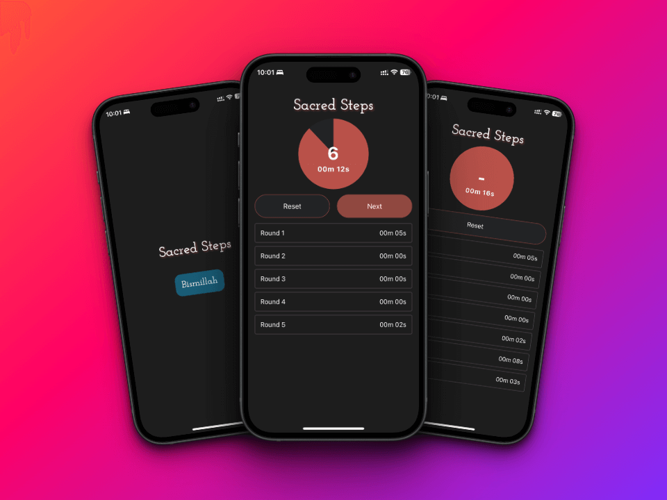

# Sacred Steps

Sacred Steps is a React Native application designed to assist users in tracking their progress during circumambulation of the holy Ka'aba. It allows users to record and monitor their time for each round, providing insights into their worship.

---

## Features

- **Round Tracking:** Keep track of each round's duration.
- **Total Time:** View the total time spent on the ritual.
- **Start, Next, and Finish Buttons:** Control the progress of the ritual with intuitive button controls.
- **Reset Functionality:** Reset the tracker at any point during the ritual.
- **Visual Feedback:** Visual representation of the progress using SVG graphics.

## Installation

To run the Sacred Steps application locally, follow these steps:

1. Clone this repository to your local machine.
2. Navigate to the project directory.
3. Run `npm install` to install the dependencies.
4. Connect a mobile device or set up an emulator.
5. Run `npm start` to start the Metro bundler.
6. Use Expo Go app or the emulator to view the application.

## Technologies Used

- React Native
- React Hooks
- React Native SVG
- Expo

## Usage

1. Open the application.
2. Tap on the "Bismillah" button to start the ritual.
3. Use the "Next" button to proceed to the next round.
4. After completing all rounds, tap on the "Finish" button to end the ritual.
5. You can reset the tracker at any time by tapping the "Reset" button.

## Contributing

Contributions to Sacred Steps are welcome! If you find any issues or have suggestions for improvements, feel free to open an issue or create a pull request.

## License

This project is licensed under the [MIT License](LICENSE).
